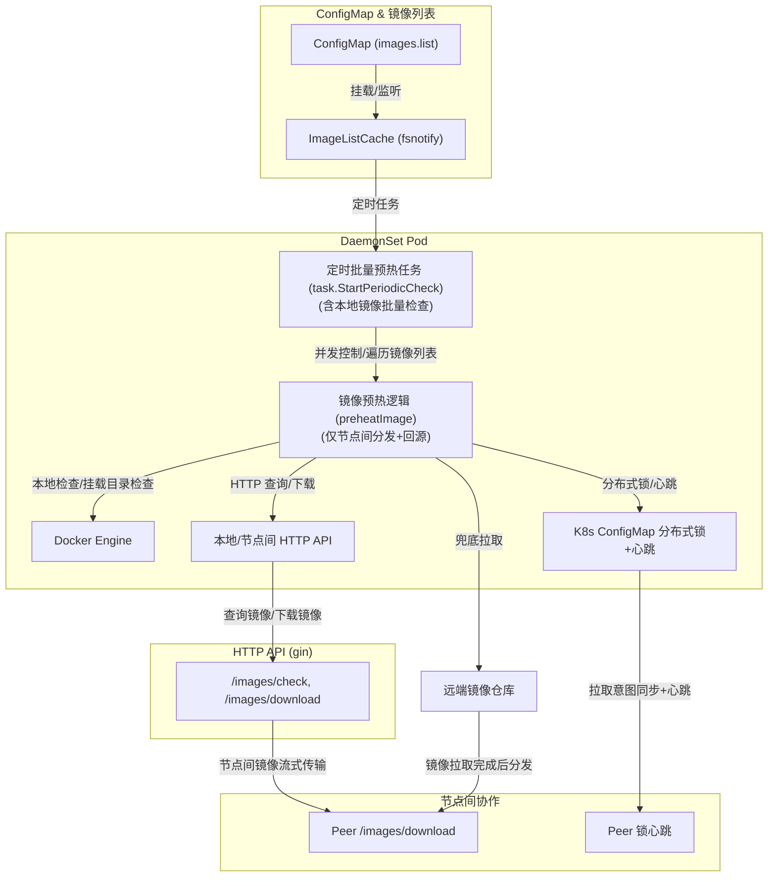

# image-preheat

Kubernetes DaemonSet 镜像预热与节点间分发系统，极大降低镜像仓库拉取压力与延迟，支持分布式锁、限速、Prometheus 监控、灵活配置。

---

## 架构总览

---

## 主要特性

- **DaemonSet 部署**：每节点本地预热，自动发现同集群节点。
- **节点间镜像分发**：优先从其他节点拉取，兜底回源 registry。
- **分布式锁**：基于 K8s ConfigMap，防止多节点重复回源。
- **限速与并发控制**：全局/接口级限速，支持环境变量配置。
- **Prometheus 监控**：丰富的拉取、分发、预热等指标。
- **热加载镜像列表**：ConfigMap+fsnotify，变更自动生效。
- **高可用/高性能**：流式传输，避免 OOM，支持大规模集群。

---

## 设计说明

- **本地镜像检查**：已在批量任务阶段（`task.StartPeriodicCheck`）完成，`preheatImage` 只负责节点间拉取和回源。
- **预热流程**：每个镜像先尝试节点间拉取，失败后通过分布式锁抢占回源。
- **分布式锁实现**：基于 K8s ConfigMap，无需任何 HTTP 接口。

---

## HTTP API

- `GET /health`  
  健康检查

- `GET /images/check?image=xxx`  
  查询本节点是否已存在镜像

- `GET /images/download?image=xxx`  
  下载镜像（本地或节点间分发，流式输出，限速）

- `GET /metrics`  
  Prometheus 指标

---

## 主要环境变量与配置

| 变量名                    | 说明                         | 默认值                  |
|--------------------------|------------------------------|------------------------|
| `NODE_NAME`              | 当前节点名（K8s Downward API）| 必填                   |
| `K8S_NAMESPACE`          | K8s 命名空间                 | default                |
| `K8S_LOCK_CM`            | 分布式锁 ConfigMap 名         | image-preheat-lock     |
| `K8S_LOCK_TIMEOUT`       | 分布式锁超时时间             | 5m                     |
| `IMAGE_LIST_PATH`        | 镜像列表文件路径              | /etc/preheater/images.list |
| `PREHEAT_CONCURRENCY`    | 本节点预热任务并发数（节点间+回源总和） | 1                      |
| `DOWNLOAD_API_CONCURRENCY`| /images/download 并发数      | 4                      |
| `INTERVAL`               | 镜像列表定时检查周期          | 1m                     |
| `PULLING_TIMEOUT`        | 拉取镜像超时时间              | 5m                     |
| `MOUNT_DIR`              | 镜像归档挂载目录              | /etc/preheater         |
| `DOWNLOAD_RATE_LIMIT`    | 节点间分发总限速（字节/秒）     | 500*1024*1024 (500MB/s)|
| `PEER_DISCOVERY_INTERVAL`| 节点发现刷新间隔                | 30s                    |

---

## 部署示例（DaemonSet + Headless Service）

详见 [`etc/headless-service.yaml`](etc/headless-service.yaml)：

- Headless Service 用于节点发现
- ConfigMap 挂载镜像列表
- 挂载 docker.sock 以便操作本地 Docker

---

## Prometheus 监控指标

- `registry_pull_total{image,result}`：回源拉取次数
- `registry_pull_duration_seconds{image}`：回源拉取耗时
- `peer_fetch_total{image,peer}`：节点间拉取成功次数
- `peer_fetch_failed_total{image,peer,reason}`：节点间拉取失败次数
- `peer_fetch_duration_seconds{image,peer}`：节点间拉取耗时
- `image_preheat_total{image,source}`：预热任务成功次数（source: 节点间/回源）
- `image_preheat_failed_total{image,source}`：预热任务失败次数
- `registry_pulling{image,node}`：当前正在回源的镜像（gauge）

---

## 运行/开发

1. 准备镜像列表 ConfigMap 并挂载
2. 挂载 docker.sock
3. 配置环境变量（见上表）
4. DaemonSet 部署
5. 访问 `/metrics` 获取 Prometheus 指标

